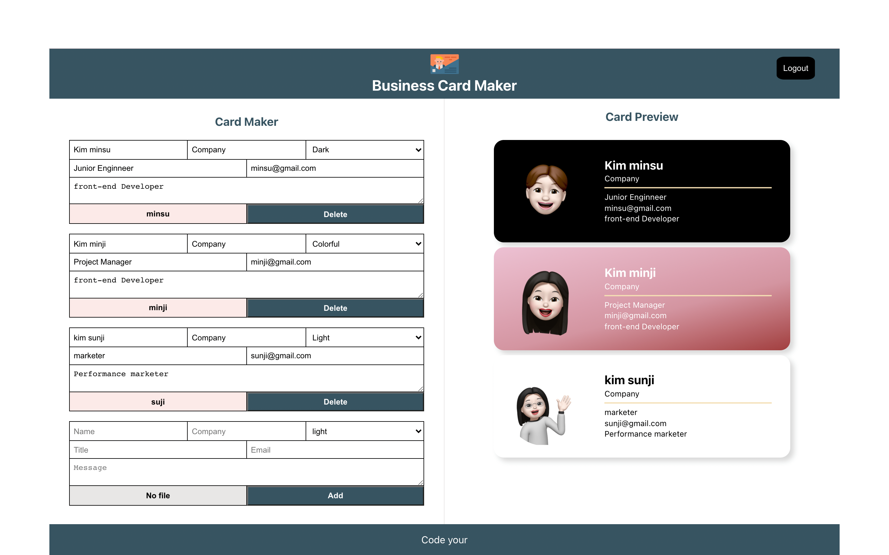
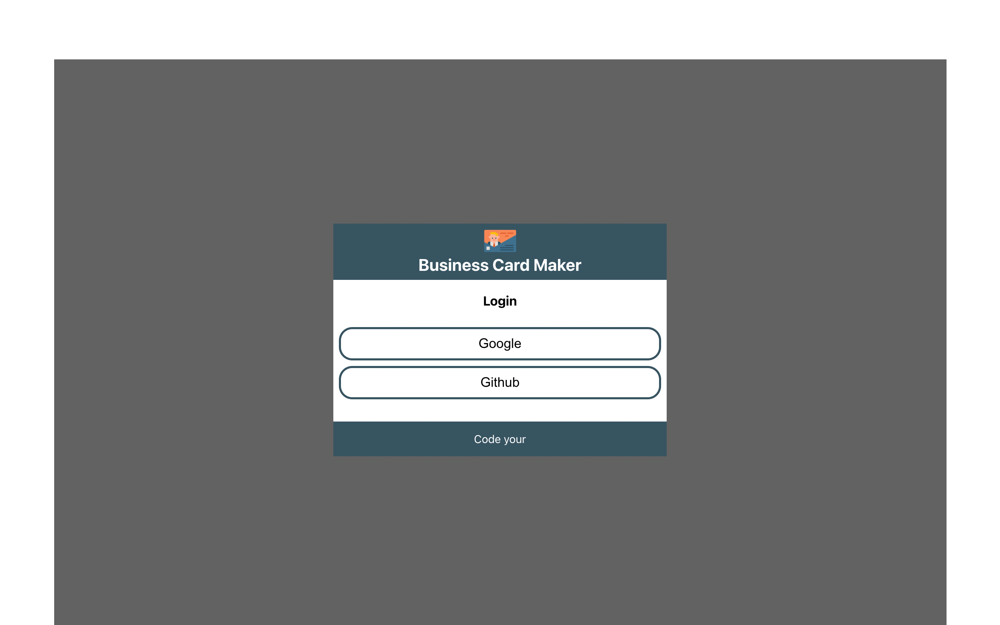
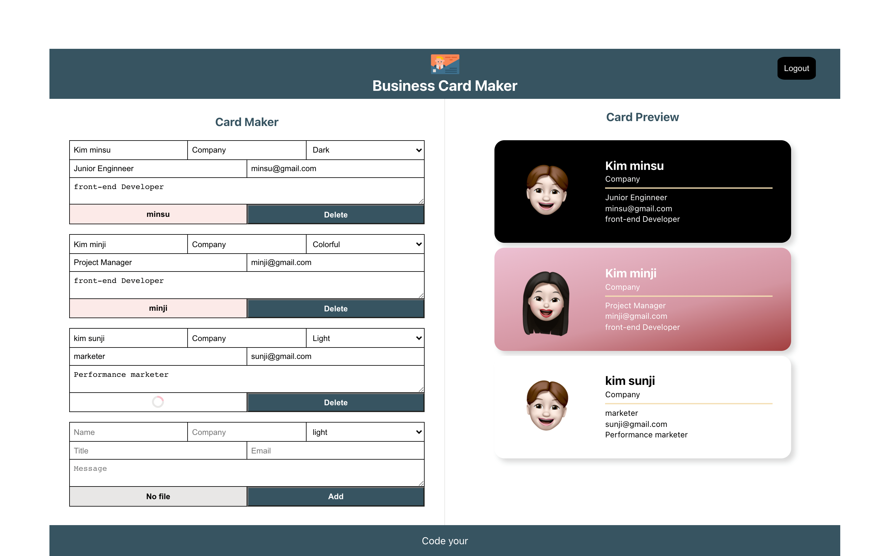
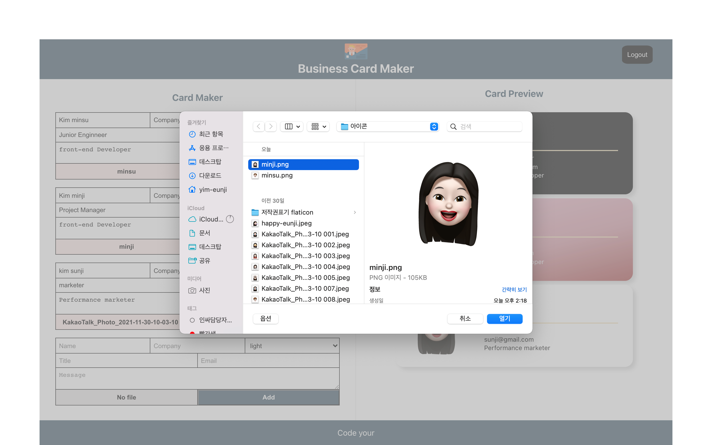

# Business Card Maker2
명함을 이쁘게 만들어주는 웹 어플리케이션 📇
 
<br><br>

## 프로젝트 소개  
로그인 화면에서 Google, Github 계정으로 로그인 할 수 있습니다. 메인 홈 화면에서는 Firebase에 저장되어있는 데이터가 뿌려집니다.  
Add, Delete 버튼을 사용했을때 수정데이터가 Firebase에 연동되어 데이터가 관리됩니다. 'No File'버튼을 클릭해서 이미지를 업로드 및 교체 할수있습니다.  
업로드 중일땐 로딩스피너가 나왔다가 이미지 업로드가 끝나면 이미지 파일의 이름이 보여집니다. Card Maker에서 변경한 내용이 Card Preview 에 보여집니다.  
<br><br>

## 기술스택 
- React Hooks
- React Router
- PostCSS
- Firebase
- Cloudnary
<br><br>

## 프로젝트 구조
```bash
├── App
│   ├── Login
│   │    ├── header
│   │    └── footer
│   └── Maker
│       ├── header
│       ├── footer
│       ├── editor
│       │   ├── editForm
│       │   └── addForm   
│       └── preview
│            └── card
├── Services
│   ├── firebase
│   ├── auth_service
│   ├── card_repository
│   └── image_upload

``` 
<br><br>

## 구현한 방법과 이유에 대한 간략한 내용
React Hook, Firebase, Cloudnary를 사용하여 만든 명합 웹 어플리케이션입니다. 
<br/>
📖 첫 번째 구현 시 강의를 보고, 공부하며 구현하였습니다.<br/>
📖 두 번째 구현 시에 다시 초기 상태로 만든 후 만들어 보았습니다.
<br><br>


## 구현하면서 어려웠던 점과 해결 방법 (Error Handling Log)

1. 헷갈리는 CSS  
그동안 CSS를 크게신경쓰지않고 리액트, 자바스크립트 공부에 집중했는데 CSS를 하려니 생각보다 잘 기억나지 않았습니다. 헷갈리는 CSS를 공부하여 기술블로그에 정리하였습니다. https://salangdung.tistory.com/270
<br/><br/>

2. firebase 데이터가 쌓이지 않는 오류  
Permission denied in Firebase Realtime Database 오류가 발생했습니다. 데이터베이스의 권한에 대한 문제인데, https://github.com/firebase/quickstart-js/issues/239 를 참조하여 읽기와 쓰기 모두 true로 변경 후에 오류를 해결했습니다. 

```
{
  "rules": {
    ".read": true,
    ".write": true
  }
}
```
<br/>

3. firebase 9 버전의 적용  
공부했을 때의 버전과 다른 최신버전의 firebase를 사용했습니다.
firebase로 Google, Github 로그인 로직과 realtime database를 연결하는 로직이 어려웠습니다. 공식문서에서 원하는 기능을 찾아 읽는 것과 코드를 적용하는 것이 아직 어렵습니다. 구글링과 이전 프로젝트를 참고하여 기능을 구현했는데 지속적인 공부를 통해 공식문서에 익숙해지도록 노력할 것입니다.

  - firebase.js 에서 firebaseConfig에 들어갈 값들을 세팅하고 해당 파일을 export하고 난 후 어디서 불러서 auth_service와 연결해야 하는지 헤메습니다.
`firebase: no firebase app `[default]` has been created - call firebase app.initializeapp() (app/no-app).`
에러 메시지를 발견했고, 이 에러 메시지는 firebase가 초기화되기 이전에 호출되어서 생기는 오류입니다. 9버전으로 바뀌면서 이전에 firebaseApp.auth()로 접근했다면
Auth Service 클래스 생성 시 firebaseApp를 넣어주고 클래스에선 getAuth(); 통해서
사용자를 얻는 방식으로 바뀌어 적용하고 오류를 해결했습니다.
<br/>

4. react-dom 6버전  
<pre>
5          -> 6   
Switch     -> Routes  
useHistory -> useNavigate
</pre>
https://reactrouter.com/docs/en/v6/getting-started/concepts#locations


<br><br>


## Screen Shot 📸

- 이미지1 : Google, Github 계정으로 로그인 할 수 있는 로그인 화면입니다. 
 
- 이미지2 : 데이터를 작성 후 보여시는 실행화면입니다. 
 
- 이미지3 : 이미지 선택 후 파일이 업로드 되기전까지 로딩스피너가 보여집니다.   

- 이미지4 : No File 버튼 클릭시 이미지를 선택할수 있는 창이 열립니다. 이미지를 선택하고 확인하면 명함앱에 이미지파일이 업로드됩니다. 

